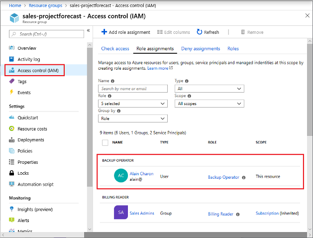
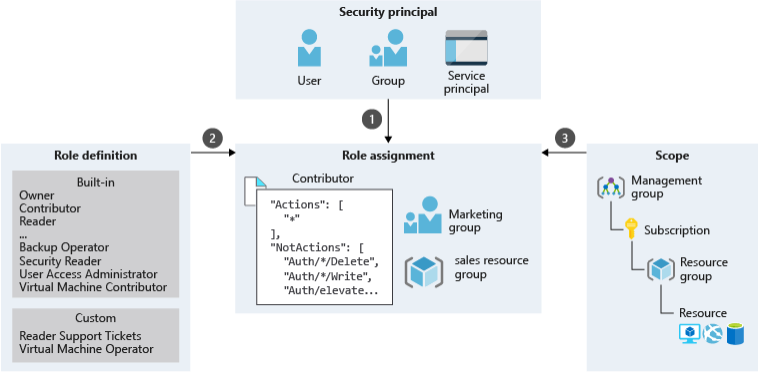

# Cómo proteger sus recursos de Azure con Azure RBAC

## ¿Qué es Azure RBAC?
Cuando se trata de identidad y acceso, la mayoría de las organizaciones se preocupan por dos cosas:
- Asegurarse de que cuando las personas abandonen la organización, pierdan el acceso a los recursos en la nube.
- Lograr el equilibrio adecuado entre autonomía y gobierno central.

El control de acceso basado en roles de Azure (Azure RBAC) es un sistema de autorización en Azure que lo ayuda a administrar quién tiene acceso a los recursos de Azure, qué pueden hacer con esos recursos y dónde tienen acceso.

## ¿Cómo funciona Azure RBAC?

- Otorga acceso asignando el rol de Azure adecuado (lo que puede hacer) a usuarios, grupos y aplicaciones (quién) en un determinado ámbito. (dónde)
- El alcance de una asignación de funciones puede ser un grupo de administración, una suscripción, un grupo de recursos o un solo recurso.
- El rol de Azure que asigne determina qué recursos puede administrar el usuario, el grupo o la aplicación dentro de ese ámbito.
- Un rol asignado en un ámbito principal también otorga acceso a los ámbitos secundarios contenidos en él.

    

## ¿Qué puedo hacer con Azure RBAC?

- Permita que un usuario administre máquinas virtuales en una suscripción y otro usuario administre redes virtuales
- Permitir que un grupo de administradores de bases de datos administre bases de datos SQL en una suscripción
- Permitir que un usuario administre todos los recursos en un grupo de recursos, como máquinas virtuales, sitios web y subredes.
- Permitir que una aplicación acceda a todos los recursos de un grupo de recursos

    

## Asignación de roles



## NotActions

- Utilice NotActions para crear un conjunto de permisos no permitidos. El acceso otorgado por un rol, los permisos efectivos, se calcula restando las operaciones NotActions de las operaciones Actions.

- Por ejemplo, el rol de colaborador tiene acciones y no acciones. El comodín (*) en Acciones indica que puede realizar todas las operaciones en el plano de control. Luego, resta las siguientes operaciones en NotActions para calcular los permisos efectivos:
    - Eliminar roles y asignaciones de roles
    - Crear roles y asignaciones de roles
    - Otorga acceso de administrador de acceso de usuario a la persona que llama en el ámbito del inquilino
    - Cree o actualice cualquier artefacto de plano
    - Eliminar cualquier artefacto de plano

---
## Demo

## Listar accesso

1. Lista de asignaciones de role para un resource group

    ```sh 
    az role assignment list --include-inherited --resource-group {resourcegroupname} --output json --query '[].{principalName:principalName, roleDefinitionName:roleDefinitionName, scope:scope}'
    ```

2. Lista de asignaciones de roles para una usuaria

    ```sh
    az role assignment list --all --assignee {objectId}
    ```

3. Enumere las asignaciones de roles para una suscripción

    ```sh
    az role assignment list --subscription {subscriptionNameOrId}
    ```

## Asignar roles de Azure mediante la CLI de Azure


1. Determinar quién necesita acceso
    ```sh
    az ad user show --id "{principalName}" --query "objectId" --output tsv
    ```
    Podemos guardar este valor en una variable `objectId`
    ```sh
    objectId=$(az ad user show --id {principalName} --query "objectId" --output tsv)
    ```

2. Crear la asignación de rol
    ```sh
    az role assignment create --assignee {objectId} --role reader --resource-group {resourcegroupname}
    ```
3. Verifique que se haya creado la asignación

    ```sh
    az role assignment list --include-inherited --resource-group {resourcegroupname}
    ```

## Quitar roles de Azure mediante la CLI de Azure

1. Quitar rol a un usuario
    ```sh
    az role assignment delete --assignee $user --role reader --resource-group {resourcegroupname}
    ```
## Listar roles disponibles

```sh
az role definition list --custom-role-only false --output json --query '[].{roleName:roleName, description:description, roleType:roleType}'
```

## ¿Quiere aprender más?

- [Concesión de acceso de usuario a los recursos de Azure mediante Azure Portal](https://docs.microsoft.com/azure/role-based-access-control/quickstart-assign-role-user-portal)
- [Protección de los recursos de Azure con el control de acceso basado en roles de Azure (Azure RBAC](https://docs.microsoft.com/learn/modules/secure-azure-resources-with-rbac/)